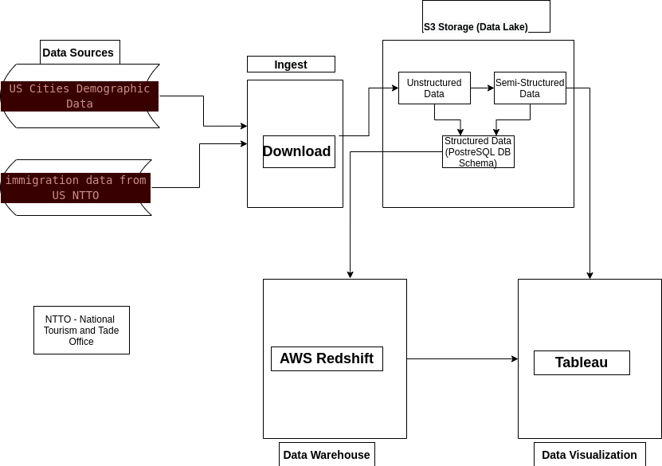
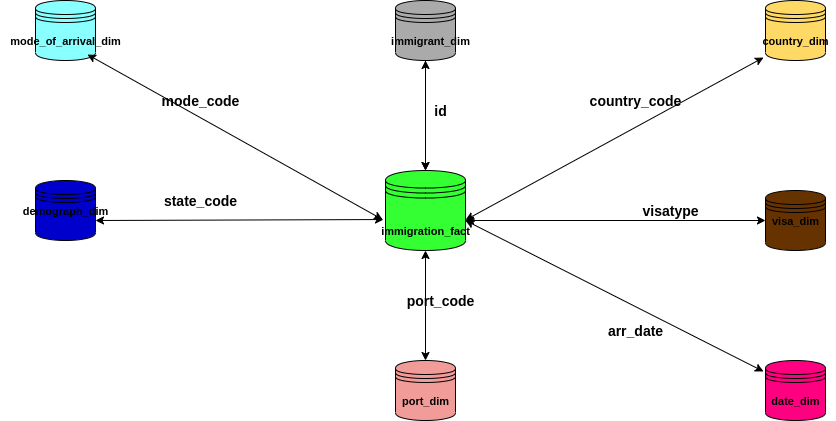
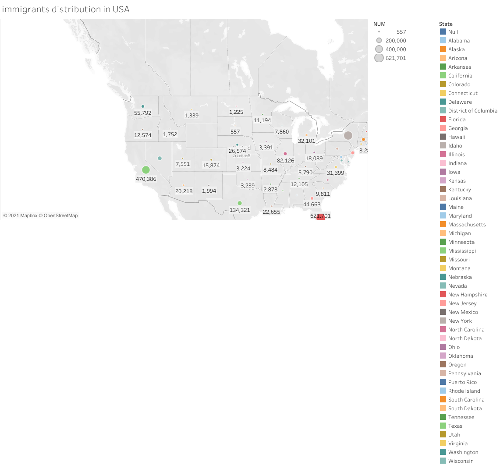
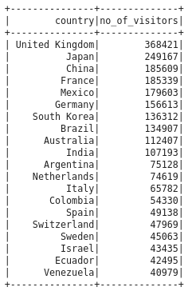
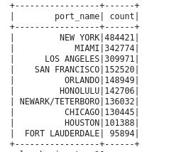

# Truth Table of USA immigrants database
This project focuses on helping an agent working on the USA immigrants data to gain useful insights by performing analysis on the data curated over time from all the migrants who are in or had visited the United States of America for one reason or the other. In order to achieve a comprehensive analysis as well as have a panoramic view of the desired insights, datasets are collected from two major sources. They are:
* [US Cities Demographics Data](https://public.opendatasoft.com/explore/dataset/us-cities-demographics/table/)
* [immigration data from US National Tourism and Trade Office (2016)](https://www.trade.gov/national-travel-and-tourism-office). The latter source was also used to extract additional datasets saved in different files such as port.csv, mode_of_arrival.csv, visatype.csv and country.csv.
There are other datasets manually extracted from [US National Tourism and Trade Office (2016)](https://www.trade.gov/national-travel-and-tourism-office). They are introduced in **Data Sources** section. 


The project adopted a **Data Lake** architecture where both processed data in form of structured and semi-structured data as well as the raw data (unstructured data) are made available to the agent. The reasons are as follows:
* The structured and semi-structured data provides consistency and high performance in data analysis leading to faster and accurate decisions.
* The organization is most likely going to explore machine learning, natural language processing and others in further processing of the data and in performing predictive analysis. In this scenario, it is expedient to make the raw data accessible in order to discover what suits different needs, among others.

The figure below adapted from [Udacity Knowledge](https://knowledge.udacity.com/questions/131241) captures the architectural view of the project succintly. 


The architecture which presents different processes can be summarized as follows:

1. Data ingestion: This involves downloading the datasets from their individual sources. 
1. Reading the datasets and saving them in AWS S3 storage. This can be done in two ways leading to either unstructured or semi-structured data. The two approaches are namely:

    * Saving the datasets in their original formats or different formats with or without inferred schema. This is the unstructured data format.
    * In the semi-structured data format, schemas are defined for each dataset while the datasets are read with the defined schemas. The read datasets are used to extract some columns into different dataframes which are saved mostly in different formats depending on the usage and or tools for processing them. 
The unstructured and semi-structured data can be used to populate a structured data schema patterned after PostgreSQL database schema. The data schema consisting of various tables are defined with the right data types according to the chosen database (PostgreSQL DB in this project). The data model adopted in the project is a star schema consisting of a fact table called immigration_fact and seven dimensional tables namely:  immigrant_dim, date_dim, mode_of_arrival_dim, port_dim, country_dim, demography_dim and visa_dim. 
The data schema is discussed in more details below in **Data Model Concept.**

1. AWS Redshift: Moving the data to the AWS data warehouse cloud has a number of benefits, such as supporting both operational and analytical processes, enabling of integration of different data sources with ease, high performance and throughputs of data flow. The data warehouse of the project is also used to perform integrity constraint check of the tables against appropriate data types and unique keys on Postgres Database. 

1. Data Visualization in Tableau: Tableau is used to visualized the data coming either directly from AWS Redshift or from the data lake which is S3 storage. This can equally be used to produce the dashboards to presents the data visually to the users.

## Data Model Concept

The goal of the project once again is to build Truth table of immigrants database in the US. This project considers Star Schema as the ideal data model. A star schema data model has at its centre a fact table surrounded by a set of dimensional tables. Each dimensional table is directly connected to the fact table via a field. This makes the latter a gateway to interconnect all the tables. The choice of the model stems from the fact that a star schema model makes querying of data simpler and faster as well as easier to perform aggreagations and find useful insights quickly. 

### Data Sources 
Data sources for the project are:
* immigration data from US National Tourism and Trade Office (2016) in a folder "sas_data"
* US cities demographics data in a file "us-cities-demographics.csv" from [US Cities Demographics Data](https://public.opendatasoft.com/explore/dataset/us-cities-demographics/table/)
* US port data extracted from [immigration data from US National Tourism and Trade Office (2016)](https://www.trade.gov/national-travel-and-tourism-office)
* Visatypes data issued by the responsible US offices extracted from https://www.trade.gov/i-94-arrivals-program into the file 'visatype.csv'
* mode of arrival data extracted from [immigration data from US National Tourism and Trade Office (2016)](https://www.trade.gov/national-travel-and-tourism-office). This tells if an immigrant arrived USA via land, air or sea.
* Countries data extracted into "countries_and_cities.csv" file from [immigration data from US National Tourism and Trade Office (2016)](https://www.trade.gov/national-travel-and-tourism-office)

### ETL Data Pipelines 
The data pipelines for the project are  as follows:

1. The downloaded datasets are read into different dataframes. For instance, the immigration dataset is read into **immigration_df** dataframe while the US cities demographic dataset is read into **df_demograph** dataframe. In the same vein, port, countries, visatype and mode of arrival datasets are read into **port_df, country_df, visa_df and mode_of_arrival_df** respectively. The following **transformations** are are performed on the immigration_df:

    * A procedure to clean up the immigration dataframe by filling in the null values using a function called **fillNullFunc()**. The doc string of the function explains how the null values are filled on column basis.
    * The "arrdate" and "depdate" columns of the immigration_df are converted from SAS format to date format using a **user-defined function (UDF) called date_converter**.
    * A function to cast the different columns to the appropriate data types and create respective new columns for them was defined. The function is known as **castColumnFunc()**. The doc string of the function has full details.

1. The **extraction** stage is performed using a procedure known as **extractDimFactTables**. The doc string provides further details which include:

   * immigration_fact table was extracted from the "immigration_df" dataframe 
   * immigrant_dim - to be extracted from the "immigration_df"
   * date_dim - to be extracted from the "immigration_df"
   * port_dim - to be extracted from the "port_df"
   * mode_of_arrival_dim - to be extracted "mode_of_arrival_df"
   * demographic_dim - extracted from "df_demograph"
   * country_dim - extracted from "country_df"
   * visa_dim - extracted from the "visatype_df"
1. **Loading** is carried out using three different functions, namely:
    * write_func(): Procedure - to write or save tables in AWS S3 or locally in a directory.
    *  load_staging_tables():  A function to load the tables from AWS S3 into the redshift
    * write_func_in_files():  A function to write or save the extracted tables or dataframes into different files in CSV FORMAT locally in the device.


The data model is shown in the diagram below.


 

### Data Quality Checks
The data quality check is carried out in two ways, viz:
* Checking the completeness of the different tables by performing number of rows count using a fucntion called **qualityCheckFunc()**. The function simply checks if the table is empty or not and prints the number of rows in the table when it is not empty.
* The second approach is subtle in nature. By loading the data in tables defined using appropriate data types specific to PostreSQL database, this method ensures that every column has the right data type.

### Software Packages used
The following software packages and resources were used for the project:
* [Apache Spark](https://spark.apache.org/)
* [Pyspark](https://spark.apache.org/docs/latest/api/python/)
* [Python](https://www.python.org/)
* [AWS Redshift](https://us-west-2.console.aws.amazon.com/redshiftv2/home?region=us-west-2#)
* [AWS S3](https://s3.console.aws.amazon.com/s3/home?region=us-west-2#)

The choice of the software stack stems from the fact that the project can be scaled up without changing the stack. As the data increases in size, Spark, Redshft and S3 would be ever capable of processing and storing the data without any negative impacts on the performance. With increased number of persons that access the database the stack will perform efficiently and effectively without necessarily effecting any changes. 
However, if the data is used to populate a dashboard regularly on daily, weekly or monthly basis, there would be need to add another tool to the stack. Ideally, [Apache Airflow](https://airflow.apache.org/) will be most suitable to automate the process. For a daily update, the schedule_interval has to be set at "@daily". 


### Data Update
The main dataset of this project which comes from the US National Tourism and Trade Office is updated once in a month. Hence, it is expedient to update the database of the project monthly to be in sync with the records at the National Tourism and Trade Office. 

### Data Dictionary
A data dictionary or metadata is attached to this project in a separate pdf file. The file gives details of the data types and descriptions of all the fields in different tables used in the project. 

### Special Cases of Increased Data Voulume and Number of Accesses
With increase in data size to say 100x the current size, there will be need to store the data in Apache Cassandra(a NoSQL database designed for scalability and high availability without any negative impacts on the high performance) . If the number of accesses to the database grows to over 100+, it may be great to integrate Apache Pulsar. This integration provides four advantages, namely: scalability, geo-replication, multi-tenancy and queuing. More details of this approach are captured in [DataStaX: Need for Apache Pulsar in Data Stack](https://datastax.medium.com/four-reasons-why-apache-pulsar-is-essential-to-the-modern-data-stack-b90a8bddcb9). 

### A Simple Analysis and Summary
A simple analysis of the data was conducted using both Tableau visualization and Spark SQL. The following results were found to be true using Spark SQL:
* The immigration_fact table has **3096313** number of rows
* The date_dim table has **3096313** number of rows
* The immigrant_dim table has **3096313** number of rows
* The mode_of_arrival_dim table has **5** number of rows
* The port_dim table has **660** number of rows
* The visa_dim table has **20** number of rows
* The country_dim table has **289** number of rows
* The demograph_dim table has **2891** number of rows

The diagram below is a map view of how immigrants are distributed in different US states for the year 2016. The follwoing results were obtained in Tableau:
* Florida has the highest number of immigrants: **621,701**
* New York accommodated **553,677** immigrants
* California has **470,386** immigrants
* Texas has **134,321** immigrants
* South Dakota has only **557** immigrants




### Running the Code
```
python3 sql_queries.py
python3 create_tables.py
python3 project.py 
project.ipynb

```

### The Process Results
The results show that:
* All the **3096313 immigrants** arrived US in April (autumn) 2016.
* Highest number of visitors (immigrants) are from the following countries:



* The popular ports of entry and number of immigrants passing through them are:

.

* The popular ports of choice of some countries are as follows:


### Authors
Ernest Offor Ugwoke 

### Previous Works 
* [AWS Cloud Data Warehouse](https://gitlab.com/offor20/aws_cloud_data_warehouse)
* [Data Lake in AWS EMR](https://gitlab.com/offor20/data_lake_in_aws_emr)

### Acknowledgements
The author is very grateful to the [Udacity Data Team](www.udacity.com) for providing the datasets, their supports and supervision of the project


